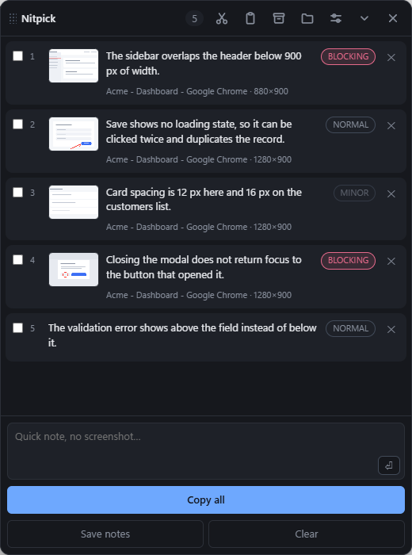

# Nitpick

**Un bloc de notas siempre visible para revisar tu propia interfaz: acumulas capturas y
notas, y las pegas todas de una vez en un agente de programación.**

[](LICENSE)


*Read this in [English](README.md).*

---

## El problema que resuelve

Estás mirando tu servidor de desarrollo y ves algo mal. Luego otra cosa. Luego una
tercera. Describirle cada una al agente según la encuentras te rompe el hilo; apuntarlas
en otro sitio significa que las capturas acaban en un lado y las palabras en otro.

La solución evidente —«lo junto todo y luego lo pego»— choca con un límite duro: **el
portapapeles de Windows admite exactamente un elemento.** O texto, o una imagen. No hay
forma de pegar ocho notas y cinco capturas de una vez.

La respuesta del Nitpick es pegar **texto que lleva las capturas por ruta absoluta**:

```
# Anotaciones (2) - 2026-09-03 12:40

## 1 · bloqueante
El sidebar se solapa con el header por debajo de 900px.
Contexto: Dashboard — MiApp — Chrome · 1280×900
Captura: C:\Users\tu-usuario\Nitpick\capturas\20260903-1204\01.png

## 2
El botón de submit no muestra estado de carga.
Captura: C:\Users\tu-usuario\Nitpick\capturas\20260903-1204\02.png
```

Es la única forma que cabe en una sola pegada y sigue dando al agente acceso a todas las
imágenes. Lo pegas en **Claude Code**, **Codex** u **OpenCode** y el agente abre las
capturas solo.

## Captura de pantalla



*Una revisión en curso. Cada nota conserva su recorte, la ventana de la que salió y una
prioridad que el agente puede leer.*

## Instalación

**Descarga** el último `Nitpick.exe` de la página de
[Releases](https://github.com/juanfranbrv/nitpick/releases). Es un único ejecutable
autocontenido: sin instalador y sin runtime que añadir. Windows 10 (2004+) u 11.

**O compílalo tú:**

```bash
pnpm install
pnpm tauri build --no-bundle
```

El binario aparece en `src-tauri/target/release/nitpick.exe`. Necesita
[Rust](https://rustup.rs), [Node](https://nodejs.org) y las herramientas de compilación
de MSVC.

## Cómo se usa

1. Pulsa <kbd>Ctrl</kbd>+<kbd>Alt</kbd>+<kbd>A</kbd>. La pantalla se congela, arrastras
   un rectángulo sobre lo que está mal y escribes la nota ahí mismo.
   <kbd>Ctrl</kbd>+<kbd>Enter</kbd> la guarda y vuelves a lo que estabas haciendo.
2. Repite tantas veces como haga falta. El panel solo lleva la cuenta.
3. Pulsa **Copiar todo** (o <kbd>Ctrl</kbd>+<kbd>Alt</kbd>+<kbd>C</kbd>) y pega en tu
   agente.

### Dibujar sobre la captura

Cuatro herramientas en la barra del compositor:

| Herramienta | Para qué |
| --- | --- |
| ✎ Rotulador | Trazo libre |
| ↗ Flecha | Señalar un control concreto |
| ▭ Recuadro | Encerrar una zona |
| ▒ Difuminar | Tapar claves, tokens o datos de clientes antes de compartir |

Color y grosor se recuerdan entre capturas. <kbd>Ctrl</kbd>+<kbd>Z</kbd> deshace el
último trazo. Todo se quema en el PNG, así que el agente ve exactamente lo que le has
señalado.

Si lo que falla es la **relación entre dos zonas alejadas**, no hace falta encuadrarlas:
pulsa <kbd>Enter</kbd> y anotas sobre la pantalla completa congelada.

### Contexto automático

Cada captura guarda además el **título y el tamaño de la ventana** que tenías delante,
que es la mitad de un informe de fallo y no hay que teclearla.

### Notas sin captura

La caja del pie admite varias líneas: <kbd>Ctrl</kbd>+<kbd>Enter</kbd> o el botón `⏎` la
añaden a la lista. Y <kbd>Ctrl</kbd>+<kbd>V</kbd> con una imagen en el portapapeles la
convierte en una anotación, para capturas hechas con
<kbd>Win</kbd>+<kbd>Shift</kbd>+<kbd>S</kbd> o que te haya mandado otra persona.

### Ordenar, priorizar y copiar solo una parte

- Arrastra una nota **por su número** para reordenarla: el orden en que ves las cosas no
  es el orden en que quieres que se arreglen.
- El chip de cada nota cicla su **prioridad**: normal → bloqueante → menor. La prioridad
  viaja en el texto copiado, así que el agente sabe por dónde empezar.
- Las **casillas** limitan la copia: con tres marcadas, el botón pasa a «Copiar 3». Sin
  ninguna marcada copia todo.

### Guardar, abrir y vaciar notas

- **Guardar notas** escribe la lista completa en `guardadas\<sesión>.md`, deja las
  capturas donde están y empieza una lista nueva. Nada se pierde.
- El botón de la cabecera abre la lista de **notas guardadas**: pulsa una y vuelve a
  cargarse en el panel, con sus capturas. Si la lista actual no está vacía se guarda
  antes, previa confirmación, de modo que abrir nunca pisa nada.
- **Vaciar** borra las notas y sus PNG. Pide confirmación.

El `.md` **es** el formato de archivo: no hay un JSON paralelo que se pueda
desincronizar, y una lista guardada se puede editar a mano en cualquier editor y seguirá
abriéndose. Un test de ida y vuelta (`cargo test`) protege esa propiedad.

## Ajustes

El engranaje del panel: tema (oscuro / claro / según Windows), opacidad de la ventana,
**plantilla de salida** y si el panel queda fuera de las capturas.

Esa última merece explicación. Activada (por defecto), Windows deja el panel fuera de
**toda** captura de pantalla, no solo de las del Nitpick — también de OBS, Teams,
<kbd>Win</kbd>+<kbd>Shift</kbd>+<kbd>S</kbd> y cualquier grabación. A cambio, la captura
propia es unos 70 ms más rápida y el panel no parpadea. Desactívala si alguna vez
necesitas que el panel salga en una grabación o una demo.

La **plantilla** envuelve el texto copiado, porque Claude Code, Codex y OpenCode no
responden igual al mismo preámbulo. `{{notas}}` es el listado; `{{total}}` y `{{fecha}}`
son opcionales. Si te dejas `{{notas}}` fuera, las notas se añaden al final en lugar de
perderse.

La plantilla **no** afecta a las notas guardadas: el archivo se escribe siempre en el
formato canónico, o cambiarla dejaría ilegibles las notas ya guardadas.

El tamaño del panel se recuerda solo: lo estiras y ahí se queda, entre colapsos y entre
ejecuciones. Todo vive en `settings.json`.

## Dónde se guarda todo

```
%USERPROFILE%\Nitpick\
  session.json              lista de anotaciones en curso (sobrevive a reinicios)
  settings.json             ajustes
  capturas\<sesión>\NN.png  los recortes
  guardadas\<sesión>.md     listas archivadas con «Guardar notas»
```

## Atajos

| Atajo | Qué hace |
| --- | --- |
| <kbd>Ctrl</kbd>+<kbd>Alt</kbd>+<kbd>A</kbd> | Capturar región y anotar |
| <kbd>Ctrl</kbd>+<kbd>Alt</kbd>+<kbd>C</kbd> | Copiar todas las anotaciones |
| <kbd>Ctrl</kbd>+<kbd>Enter</kbd> | Guardar la nota que estás escribiendo |
| <kbd>Ctrl</kbd>+<kbd>V</kbd> | Pegar una imagen del portapapeles como anotación |
| <kbd>Enter</kbd> | En el selector: anotar sobre la pantalla completa |
| <kbd>Ctrl</kbd>+<kbd>Z</kbd> | Deshacer el último trazo |
| <kbd>Esc</kbd> | Cancelar la captura |

Si otro programa ya usa uno de los atajos globales, el Nitpick arranca igual y te lo
avisa en el panel: pierdes el atajo, no la aplicación.

## Cómo está montado

El selector de región no dibuja sobre una ventana transparente: primero captura **todos**
los monitores con [`xcap`](https://crates.io/crates/xcap) y los compone en una sola
imagen con la disposición del escritorio virtual (`src-tauri/src/capture.rs`), y esa
imagen congelada es el fondo de la ventana de selección. Así la pantalla no puede cambiar
mientras arrastras, una selección puede cruzar dos monitores, y no hay que pelearse con
la transparencia y el click-through de Windows.

Cuatro decisiones sostienen la latencia entre pulsar el atajo y ver el selector, que
empezó en 769 ms y acabó en 112 ms:

- La captura **no pasa por disco**. Vive en memoria y llega al webview por un esquema URI
  propio como **BMP** sin comprimir, que es prácticamente una copia de memoria.
  Comprimir un PNG del escritorio entero y volver a leerlo costaba cientos de
  milisegundos.
- La ventana de selección se **construye una sola vez** al arrancar y se reutiliza
  oculta. Crear un webview por captura costaba la otra mitad del retardo.
- Los monitores se componen con **copias fila a fila** (`copy_from_slice`) en vez de
  `imageops::replace`, que recorre píxel a píxel: 271 ms de 408 en un equipo de dos
  pantallas.
- El panel **no se oculta**: se le pide a Windows que lo excluya de las capturas
  (`SetWindowDisplayAffinity`). Ocultarlo obligaba a esperar ~70 ms a que el compositor
  repintase — la mitad de lo que quedaba — y hacía parpadear el panel en cada atajo.

Un detalle que costó dos intentos: optimizar solo las dependencias
(`profile.dev.package."*"`) no bastaba, porque el bucle de composición vive en *este*
crate. Con `profile.dev` también optimizado, componer dos monitores pasó de 133 ms a
1 ms.

La selección viaja al backend como **fracciones** de la imagen (0..1), no como píxeles,
de modo que el escalado de pantalla nunca entra en la aritmética del recorte.

El difuminado no pinta píxeles opacos encima: vuelve a dibujar la propia captura sobre sí
misma a través de un filtro CSS, recortando el resultado al rectángulo. Sin ese recorte
el filtro muestrearía más allá del borde y dejaría un halo suave en vez de un parche de
bordes limpios.

## Limitaciones conocidas

- Con dos monitores a **escalados de DPI distintos**, la composición del escritorio
  virtual puede desalinearse. Con escalado uniforme funciona bien.
- El contexto que se guarda es el **título** de la ventana y su tamaño, **no la URL**.
  Sacar la dirección de un navegador exige recorrer su árbol de accesibilidad con UI
  Automation buscando la barra de direcciones: depende del navegador y falla en silencio
  cuando cambia. El título más el tamaño es lo que se puede obtener de forma fiable.
- La interfaz está **solo en español** por ahora.

## Desarrollo

```bash
pnpm install
pnpm tauri dev      # con recarga en caliente
cargo test          # desde src-tauri/
```

Ojo: la instancia de desarrollo retiene los atajos globales, así que cierra antes
cualquier Nitpick de release o chocarán.

Se agradecen incidencias y pull requests.

## Licencia

[MIT](LICENSE).
