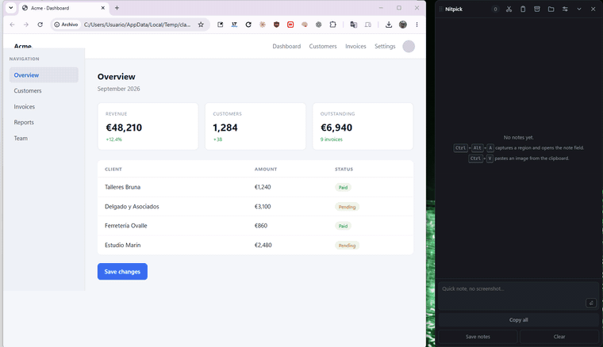

# Nitpick

**An always-on-top notepad for reviewing your own UI — collect a batch of screenshots
and notes, then paste all of them into a coding agent in one go.**

[](LICENSE)


*Léeme en [español](README.es.md). The application's interface is currently
Spanish-only.*

---

## The problem it solves

You are looking at your dev server and you spot something wrong. Then something else.
Then a third thing. Describing each one to your coding agent as you find it breaks
your flow; writing them down somewhere else means screenshots live in one place and
words in another.

The obvious fix — "collect everything, then paste it" — runs into a hard limit:
**the Windows clipboard holds exactly one item.** Either text, or one image. There is
no way to paste eight notes and five screenshots in a single paste.

Nitpick's answer is to paste **text that carries the screenshots by absolute path**:

```
# Anotaciones (2) - 2026-09-03 12:40

## 1 · bloqueante
The sidebar overlaps the header below 900px.
Contexto: Dashboard — MyApp — Chrome · 1280×900
Captura: C:\Users\you\Nitpick\capturas\20260903-1204\01.png

## 2
The submit button shows no loading state.
Captura: C:\Users\you\Nitpick\capturas\20260903-1204\02.png
```

That is the only shape that fits in one clipboard slot while still giving the agent
access to every image. Paste it into **Claude Code**, **Codex** or **OpenCode** and the
agent opens the screenshots itself.

## See it work



The shortcut freezes the screen, the drag frames the defect, the note is typed on the
spot, and one button puts the batch on the clipboard. The panel steps out of the way
while you select and comes back with the note in the list.


*A longer review. Each note keeps its own crop, the window it came from, and a priority
the agent can read.*

## Install

**Download** the latest `Nitpick.exe` from the
[Releases](https://github.com/juanfranbrv/nitpick/releases) page. It is a single
self-contained executable — no installer, no runtime to add. Windows 10 (2004+) or 11.

**Or build from source:**

```bash
pnpm install
pnpm tauri build --no-bundle
```

The binary lands in `src-tauri/target/release/nitpick.exe`. Requires
[Rust](https://rustup.rs), [Node](https://nodejs.org) and the MSVC build tools.

## How you use it

1. Press <kbd>Ctrl</kbd>+<kbd>Alt</kbd>+<kbd>A</kbd>. The screen freezes; drag a
   rectangle over what is wrong and type the note right there.
   <kbd>Ctrl</kbd>+<kbd>Enter</kbd> saves it and you are back to what you were doing.
2. Repeat as often as you need. The panel just keeps count.
3. Hit **Copiar todo** (or <kbd>Ctrl</kbd>+<kbd>Alt</kbd>+<kbd>C</kbd>) and paste into
   your agent.

### Drawing on a capture

Four tools, in the composer's toolbar:

| Tool | For |
| --- | --- |
| ✎ Marker | Freehand strokes |
| ↗ Arrow | Pointing at one specific control |
| ▭ Box | Enclosing an area |
| ▒ Blur | Covering keys, tokens or customer data before sharing |

Colour and width are remembered between captures. <kbd>Ctrl</kbd>+<kbd>Z</kbd> undoes
the last stroke. Everything is burned into the PNG, so the agent sees exactly what you
pointed at.

If what is wrong is the **relationship between two distant places**, you do not have to
frame them: press <kbd>Enter</kbd> and annotate the whole frozen screen.

### Automatic context

Every capture also records the **title and size of the window** you were looking at —
half a UI bug report, without typing it.

### Notes without a screenshot

The footer box takes several lines; <kbd>Ctrl</kbd>+<kbd>Enter</kbd> or the `⏎` button
adds it to the list. <kbd>Ctrl</kbd>+<kbd>V</kbd> with an image on the clipboard turns
it into a note, for shots taken with <kbd>Win</kbd>+<kbd>Shift</kbd>+<kbd>S</kbd> or
sent to you by someone else.

### Ordering, priority, partial copy

- Drag a note **by its number** to reorder it: the order you spot things in is not the
  order you want them fixed in.
- Each note's chip cycles its **priority**: normal → blocking → minor. Priority travels
  in the copied text, so the agent knows where to start.
- **Checkboxes** narrow the copy: tick three and the button becomes "Copiar 3". Tick
  none and it copies everything.

### Saving, reopening and clearing

- **Guardar notas** writes the whole list to `guardadas\<session>.md`, leaves the
  screenshots where they are and starts a fresh list. Nothing is lost.
- The header button opens the list of **saved notes**: click one and it loads back into
  the panel with its screenshots. If the current list is not empty it is saved first,
  after confirmation, so opening can never overwrite anything.
- **Vaciar** deletes the notes and their PNGs. Asks first.

The `.md` **is** the archive format — there is no parallel JSON to drift out of sync,
and a saved list can be hand-edited in any editor and will still reopen. A round-trip
test (`cargo test`) protects that property.

## Settings

The panel's gear: theme (dark / light / follow Windows), window opacity, the **output
template**, and whether the panel stays out of screen captures.

That last one deserves a note. Enabled (the default), Windows keeps the panel out of
**every** screen capture, not only Nitpick's — that includes OBS, Teams,
<kbd>Win</kbd>+<kbd>Shift</kbd>+<kbd>S</kbd> and any recording. In exchange, Nitpick's
own capture is ~250 ms faster and the panel does not blink. Turn it off if you ever need
the panel to appear in a recording or a demo.

The **template** wraps the copied text, because Claude Code, Codex and OpenCode do not
respond alike to the same preamble. `{{notas}}` is the list; `{{total}}` and `{{fecha}}`
are optional. Leave `{{notas}}` out and the notes are appended rather than lost.

The template does **not** affect saved notes: the archive is always written in the
canonical format, or changing it would make already-saved notes unreadable.

The panel's size remembers itself — stretch it and it stays that way, across collapses
and across runs. All of it lives in `settings.json`.

## Where everything is stored

```
%USERPROFILE%\Nitpick\
  session.json               the list in progress (survives restarts)
  settings.json              settings
  capturas\<session>\NN.png  the crops
  guardadas\<session>.md     lists archived with "Guardar notas"
```

## Shortcuts

| Shortcut | Does |
| --- | --- |
| <kbd>Ctrl</kbd>+<kbd>Alt</kbd>+<kbd>A</kbd> | Capture a region and annotate |
| <kbd>Ctrl</kbd>+<kbd>Alt</kbd>+<kbd>C</kbd> | Copy every note |
| <kbd>Ctrl</kbd>+<kbd>Enter</kbd> | Save the note being written |
| <kbd>Ctrl</kbd>+<kbd>V</kbd> | Paste a clipboard image as a note |
| <kbd>Enter</kbd> | In the selector: annotate the whole screen |
| <kbd>Ctrl</kbd>+<kbd>Z</kbd> | Undo the last stroke |
| <kbd>Esc</kbd> | Cancel the capture |

If another program already owns one of the global shortcuts, Nitpick starts anyway and
tells you in the panel: you lose the shortcut, not the application.

## How it works

The region selector does not draw over a transparent window. It first captures **every**
monitor with [`xcap`](https://crates.io/crates/xcap) and composes them into one image
laid out like the virtual desktop (`src-tauri/src/capture.rs`); that frozen image is the
selector's background. So the screen cannot change while you drag, a selection can cross
two monitors, and there is no fight with Windows transparency and click-through.

Four decisions carry the latency between pressing the shortcut and seeing the selector,
which started at 769 ms and ended at 112 ms:

- **The capture never touches disk.** It lives in memory and reaches the webview through
  a custom URI scheme as an uncompressed **BMP**, which is close to a memory copy.
  Compressing a PNG of the whole desktop and reading it back cost hundreds of ms.
- **The selector window is built once** at startup and reused hidden. Creating a webview
  per capture cost the other half of the delay.
- **Monitors are composed with row-wise `copy_from_slice`**, not `imageops::replace`,
  which walks pixel by pixel: 271 ms out of 408 on a two-screen machine.
- **The panel is not hidden.** Windows is asked to exclude it from captures
  (`SetWindowDisplayAffinity`). Hiding it meant waiting for the compositor to
  repaint — half of what remained — and made the panel blink on every shortcut.

A detail that took two attempts: optimising only dependencies
(`profile.dev.package."*"`) was not enough, because the compositing loop lives in *this*
crate. With `profile.dev` optimised too, composing two monitors went from 133 ms to 1 ms.

The selection travels to the backend as **fractions** of the image (0..1) rather than
pixels, so display scaling never enters the crop arithmetic.

Blur does not paint opaque pixels on top: it redraws the screenshot over itself through
a CSS filter, clipping the result to the rectangle. Without that clip the filter would
sample past the edge and leave a soft halo instead of a clean-edged patch.

## Known limitations

- With two monitors at **different DPI scalings**, the virtual-desktop composition can
  end up misaligned. With uniform scaling it works fine.
- The stored context is the window **title** and its size, **not the URL**. Getting the
  address out of a browser requires walking its accessibility tree with UI Automation
  looking for the address bar: browser specific, and it fails silently when it drifts.
  The title plus the size is what can be had reliably.
- The interface is **Spanish only** for now.

## Development

```bash
pnpm install
pnpm tauri dev      # run with hot reload
cargo test          # from src-tauri/
```

Note that the dev instance holds the global shortcuts, so close any release build of
Nitpick first or they will collide.

Issues and pull requests are welcome.

## License

[MIT](LICENSE).
